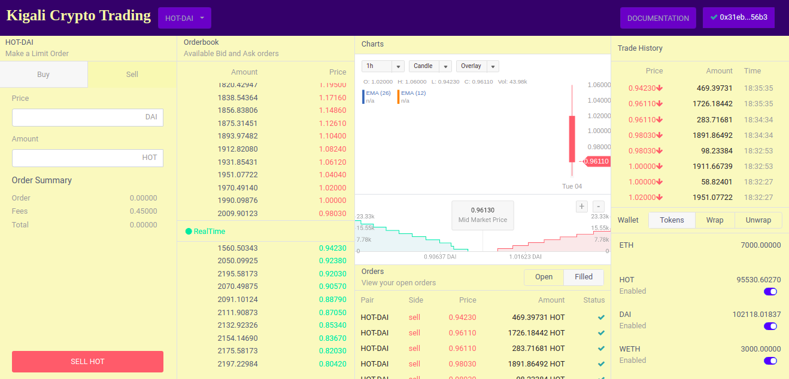

# Kigali Crypto Trading

## Launching Decentralized Exchange

### Prerequisites

The easiest way to launch Kigali-dex is via `docker` and `docker-compose`.

If you don't already have them installed, you can follow [this link](https://docs.docker.com/compose/install/) to install them (free).

### Initial Setup

1.  **Clone this repo**

        git clone https://github.com/chanceDira/kigali-dex.git

1.  **Change your working directory**

        cd kigali-dex

1.  **Build and launch your hydro relayer**

        docker-compose pull && docker-compose up -d

    This step may takes a few minutes.
    When complete, it will start all necessary services.

    Note: It will use ports `3000`, `3001`, `3002`, `6379`, `8043`, and `8545` on your computer. Please make sure these ports are available.

